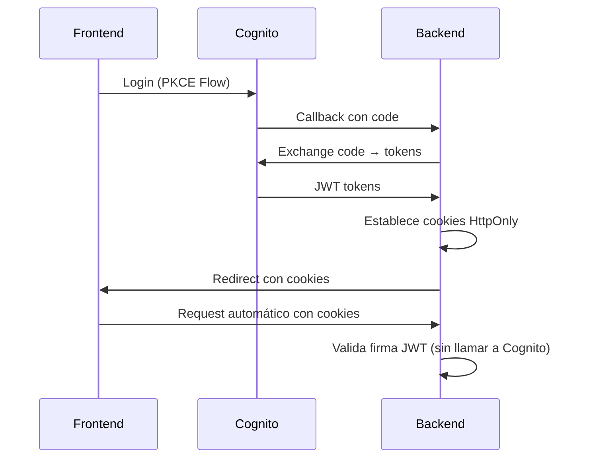

# 📚 Escuela Bíblica Salem - Arquitectura Técnica v2.0

## 📋 Resumen Ejecutivo

**Filosofía**: "Monolito Modular Asíncrono"

Sistema diseñado para **100 usuarios activos**, priorizando la simplicidad de mantenimiento y bajo costo en AWS sobre escalabilidad innecesaria. Arquitectura sin lambdas, sin gestión de servidores, con separación inteligente entre operaciones síncronas y asíncronas.

---

## 🛠️ Stack Tecnológico

### 💻 Frontend (Cliente SPA)

- **Framework**: React 18+ (Vite)
- **Estado Server-Side**: TanStack Query (React Query)
  - Manejo automático de caché y revalidación
  - Eliminamos Redux/Zustand innecesario para datos del servidor
- **Hosting**: AWS S3 + CloudFront
  - ⚠️ **No usar App Runner para frontend**: 10x más caro que CDN
- **Autenticación**: AWS Amplify SDK → Cognito directo

### ⚙️ Backend (API REST)

- **Runtime**: Python 3.11+
- **Framework**: FastAPI 0.115+ (100% Async)
- **Despliegue**: AWS App Runner (Docker Container)
- **Servidor ASGI**: 
  ```bash
  gunicorn -w 2 -k uvicorn.workers.UvicornWorker main:app
  ```
  - 2 Workers suficientes para `db.t3.micro`

### 🗄️ Persistencia

- **Base de Datos**: PostgreSQL 15+ (AWS RDS `db.t3.micro`)
- **Driver**: `asyncpg` + SQLAlchemy 2.0 (AsyncSession)
- **Almacenamiento**: AWS S3 (Guías PDF, Avatares, Certificados)

---

## 🔄 Patrones de Comunicación

### 1. Autenticación (Cookie-Based)

**Proveedor**: Amazon Cognito User Pools

**Almacenamiento**: Cookies HttpOnly con flags de seguridad:
- `HttpOnly=True`: Inaccesible vía JavaScript (protección XSS)
- `Secure=True`: Solo se envía sobre HTTPS
- `SameSite=Lax`: Protección CSRF (permite navegación top-level)
- `domain`: Configurado según entorno (None para localhost, dominio en producción)

**Flujo**:


⚠️ **Decisión Arquitectónica**: 
- **SÍ**: Cookies HttpOnly/SameSite (protección XSS, más seguro)
- **NO**: Bearer Tokens en `sessionStorage` (vulnerable a XSS)
- **CORS**: `allow_credentials=True` requerido para cookies cross-origin

### 2. Connection Pooling (Base de Datos)

- **Estrategia**: `QueuePool` (default SQLAlchemy)
- **Configuración**: `pool_size=5`, `max_overflow=10`

⚠️ **Nunca usar `NullPool` en producción**: Añade 100-300ms de latencia por reconexión SSL a RDS.

### 3. Tareas en Segundo Plano

**Librería**: FastAPI `BackgroundTasks` (sin Redis/Celery/Lambda)

```python
@router.post("/cuestionario/{id}/enviar")
async def enviar_cuestionario(background_tasks: BackgroundTasks):
    # 1. Calcula nota (SÍNCRONO)
    resultado = await service.calcular_nota(...)
    
    # 2. Responde inmediatamente
    if resultado.aprobado:
        # 3. Genera certificado EN SEGUNDO PLANO
        background_tasks.add_task(
            generar_certificado_pdf, 
            estudiante_id, 
            curso_id
        )
        return {"status": "aprobado", "nota": resultado.nota}
```

---

## ⚡ Clasificación de Operaciones: Síncrono vs Asíncrono

### 🔴 Procesos Síncronos (Bloqueantes - Respuesta Inmediata)

Estos **requieren respuesta inmediata** para que el usuario continúe. Si los haces asíncronos, rompes la UX.

| Operación | Requisito Funcional | Por qué es síncrono |
|-----------|---------------------|---------------------|
| **Login/Logout** | RF-12 | Usuario necesita acceso inmediato |
| **Validación de Roles** | RF-12 | Protección de rutas en tiempo real |
| **Listar Cursos** | RF-02 | Navegación básica |
| **Ver Guías** | RF-05, RF-06 | URL de descarga debe estar disponible al instante |
| **Progreso Personal** | RF-06 | Barra de progreso actual del estudiante |
| **Calificación de Cuestionario** | RF-01, RF-03 | ⚠️ **CRÍTICO**: Usuario necesita saber si aprobó (80%+) para decidir si reintenta |
| **Publicar en Foro** | RF-09 | Confirmación de "Publicado" (aunque notificaciones sean async) |

**Ejemplo crítico**: 
```python
# ✅ CORRECTO: Calificación síncrona
@router.post("/cuestionarios/{id}/calificar")
async def calificar(respuestas: List[Respuesta]):
    nota = await evaluar_respuestas(respuestas)  # SYNC
    aprobado = nota >= 80
    
    if aprobado:
        # Certificado en background (async)
        background_tasks.add_task(generar_certificado)
    
    return {"nota": nota, "aprobado": aprobado}  # Respuesta inmediata
```

### 🟢 Procesos Asíncronos (Segundo Plano - Workers)

Estos **no bloquean la respuesta HTTP**. Se encolan y procesan en background.

| Operación | Requisito Funcional | Implementación |
|-----------|---------------------|----------------|
| **Generación de Certificados** | RF-04 | Worker genera PDF → S3 → actualiza estado en DB |
| **Envío de Correos** | RF-09 | Encolar notificaciones/recordatorios (nunca SMTP síncrono) |
| **Métricas Comparativas** | RF-07 | Cron Job nocturno (agregaciones masivas son costosas) |
| **Reset de Intentos** | RF-11 | Archivado de historial en background |

**⚠️ Error Común**:
```python
# ❌ MAL: Generar PDF en el request HTTP
@router.post("/cuestionarios/{id}/calificar")
async def calificar():
    nota = calcular_nota()
    if nota >= 80:
        pdf = generar_certificado()  # ⬅️ Bloquea 3-5 segundos
        subir_a_s3(pdf)
    return {"nota": nota}

# ✅ BIEN: PDF en background
@router.post("/cuestionarios/{id}/calificar")
async def calificar(background_tasks: BackgroundTasks):
    nota = calcular_nota()
    if nota >= 80:
        background_tasks.add_task(
            generar_y_subir_certificado,
            estudiante_id
        )
    return {"nota": nota}  # Responde en <100ms
```

**Estrategia para Métricas Comparativas** (RF-07):
```python
# Cron Job ejecutado a las 2 AM (Lambda EventBridge o App Runner Scheduled Task)
async def recalcular_metricas_globales():
    """
    Calcula promedios de progreso por cohorte.
    NO calcular en tiempo real (too expensive).
    """
    metricas = await db.execute(
        """
        SELECT cohorte, AVG(progreso) as promedio
        FROM estudiantes
        GROUP BY cohorte
        """
    )
    await cache.set("metricas_comparativas", metricas, ttl=86400)
```

---

## 📂 Estructura del Proyecto

```
/backend
  ├── app/
  │   ├── main.py            # Entrypoint + CORS + Middleware
  │   ├── config.py          # Pydantic BaseSettings
  │   ├── database/
  │   │   ├── session.py     # AsyncSession + Engine
  │   │   └── migrations/    # Alembic
  │   ├── models/            # SQLAlchemy ORM (Tablas)
  │   ├── schemas/           # Pydantic (Request/Response)
  │   ├── routes/            # Endpoints (solo HTTP handling)
  │   │   ├── auth.py
  │   │   ├── cursos.py
  │   │   ├── cuestionarios.py
  │   │   └── foro.py
  │   ├── services/          # Lógica de Negocio Pura
  │   │   ├── cuestionario_service.py
  │   │   ├── certificado_service.py
  │   │   └── metrics_service.py
  │   ├── tasks/             # Background Tasks
  │   │   ├── email_sender.py
  │   │   ├── pdf_generator.py
  │   │   └── metrics_calculator.py
  │   └── utils/             # Helpers (Logger, Parsers)
  ├── Dockerfile             # Multi-stage build
  └── requirements.txt

/frontend
  ├── src/
  │   ├── components/
  │   ├── pages/
  │   ├── hooks/             # TanStack Query custom hooks
  │   ├── api/               # Axios instance con interceptors
  │   └── utils/
  └── vite.config.js
```

---

## 🚀 Infraestructura AWS

| Componente | Configuración | Justificación |
|------------|---------------|---------------|
| **Frontend** | S3 (bloqueado) + CloudFront (OAI) | Carga global instantánea, ~$1/mes |
| **Backend** | App Runner (1 vCPU, 2GB RAM) | HTTPS automático, escala a cero |
| **Base de Datos** | RDS Postgres `db.t3.micro` | Capa gratuita, backups automáticos |
| **Storage** | S3 Standard | Ilimitado para PDFs/Avatares |
| **Seguridad** | Security Groups | RDS solo acepta tráfico del SG de App Runner |

**Diagrama de Red**:
```
CloudFront → S3 (Frontend)
     ↓
App Runner (Backend) ←→ Cognito (Auth)
     ↓
RDS Postgres (Solo acceso desde App Runner SG)
     ↓
S3 (Certificados/Guías)
```

---

## 🔐 Seguridad de Autenticación

**Almacenamiento de Tokens**: Cookies HttpOnly

**Ventajas sobre sessionStorage**:
- **Protección XSS**: JavaScript no puede acceder a cookies HttpOnly
- **Protección CSRF**: SameSite=Lax previene ataques cross-site
- **Envío automático**: El navegador envía cookies en cada request (no requiere código JS)

**Configuración de Cookies**:
```python
# backend/app/config.py
cookie_secure = True      # Solo HTTPS en producción
cookie_samesite = "Lax"   # Protección CSRF
cookie_httponly = True    # Inaccesible vía JavaScript
cookie_access_max_age = 300      # 5 minutos
cookie_refresh_max_age = 1209600 # 14 días
```

**Compatibilidad con CORS**:
- Frontend: `credentials: 'include'` en todas las peticiones fetch
- Backend: `allow_credentials=True` en CORSMiddleware
- Dominios: Configurar `cookie_domain` según entorno

**Lectura de Tokens**:
- Prioridad 1: Cookies HttpOnly (más seguro)
- Prioridad 2: Header `Authorization: Bearer` (fallback para compatibilidad)

## 🚫 Restricciones Técnicas (Lo que NO haremos)

| ❌ Prohibido | ✅ Alternativa |
|-------------|---------------|
| `selectinload` ciego | Analizar queries. Usar `joinedload` para N-a-1 |
| Lambdas para lógica de negocio | Todo en Docker (simplifica dependencias) |
| Redis para caché | TanStack Query (frontend) + PostgreSQL (backend) |
| Lógica en `routes/` | Solo validación + llamado a `services/` |
| Enviar emails síncronos | `BackgroundTasks` siempre |
| Generar PDFs en request HTTP | Workers asíncronos |
| Almacenar tokens en `sessionStorage` | Cookies HttpOnly (protección XSS) |

---

## 🎯 Principios de Diseño

1. **Monolito Primero**: Dividir en microservicios es innecesario para 100 usuarios.
2. **Async donde importa**: Base de datos y I/O de archivos.
3. **Síntesis de Operaciones**: 
   - ¿El usuario espera? → Síncrono
   - ¿Puede continuar sin esperar? → Asíncrono
4. **Observabilidad**: Logs estructurados (JSON) en CloudWatch.
5. **Fail-Fast**: Si un certificado no se genera, notificar al admin (no al usuario).

---

## 📞 Contacto y Contribución

Para preguntas sobre decisiones arquitectónicas, revisar los comentarios en:
- `app/services/cuestionario_service.py` (lógica de calificación)
- `app/tasks/pdf_generator.py` (generación de certificados)
- `app/config.py` (variables de entorno)

**Mantenedor**: Equipo de Desarrollo Escuela Bíblica Salem